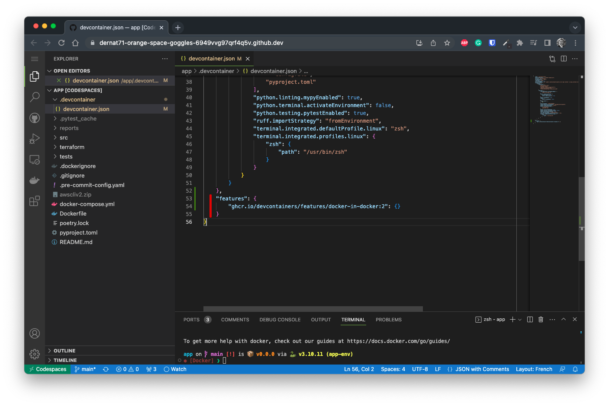

# Prerequisites

This page will introduce you to a few prerequisites that you need to complete before starting the tutorials.

## Enable Docker in your GitHub CodeSpace.

In order to be able to build and push your Docker image to your ECR repository, you need to enable
the Docker option in your GitHub CodeSpace. You can do that quite easily by editing the `.devcontainer.json`
file located in the root of your repository. You need to add the following lines inside of it:

```json
"features": {
    "ghcr.io/devcontainers/features/docker-in-docker:2": {}
}
```

You can add them anywhere within the root structure of the `devcontainer.json` file. Here's an example:



Once done, you need to rebuild your CodeSpace. To do so, you can either click on the pop-up `Rebuild Container`
that should appear in the bottom right corner of your CodeSpace or you can press <kbd>CTRL</kbd><kbd>+</kbd><kbd>P</kbd> 
and type `> Codespaces: Rebuild Container` to find the associated command.

Also, don't forget to commit and push your changes to your repository!