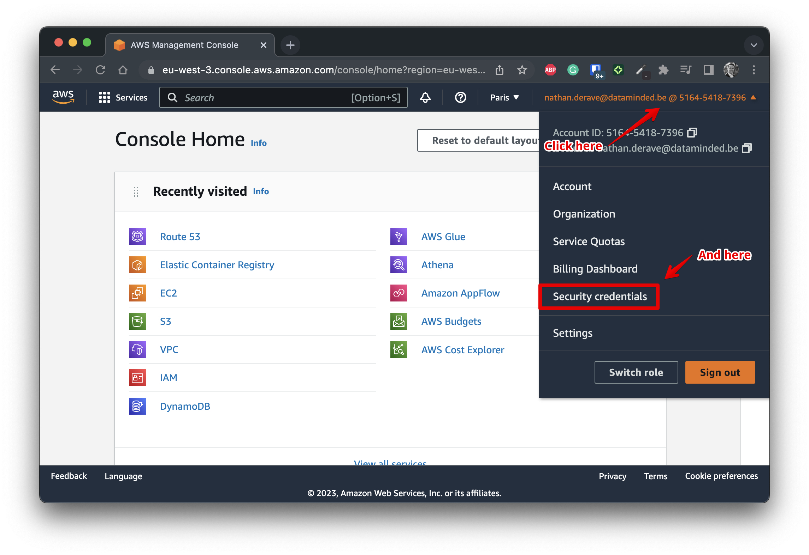
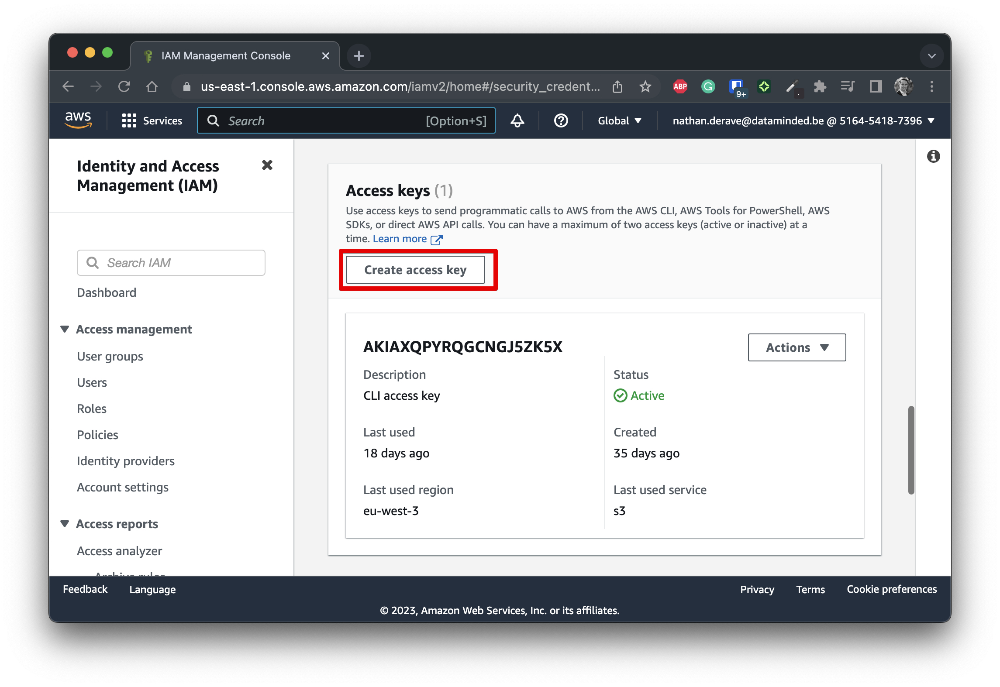
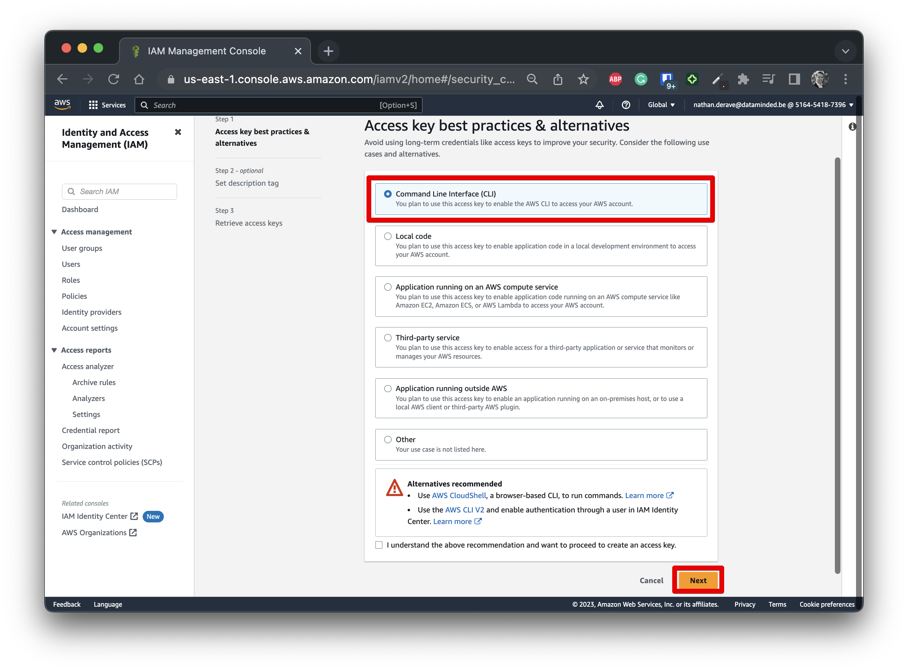
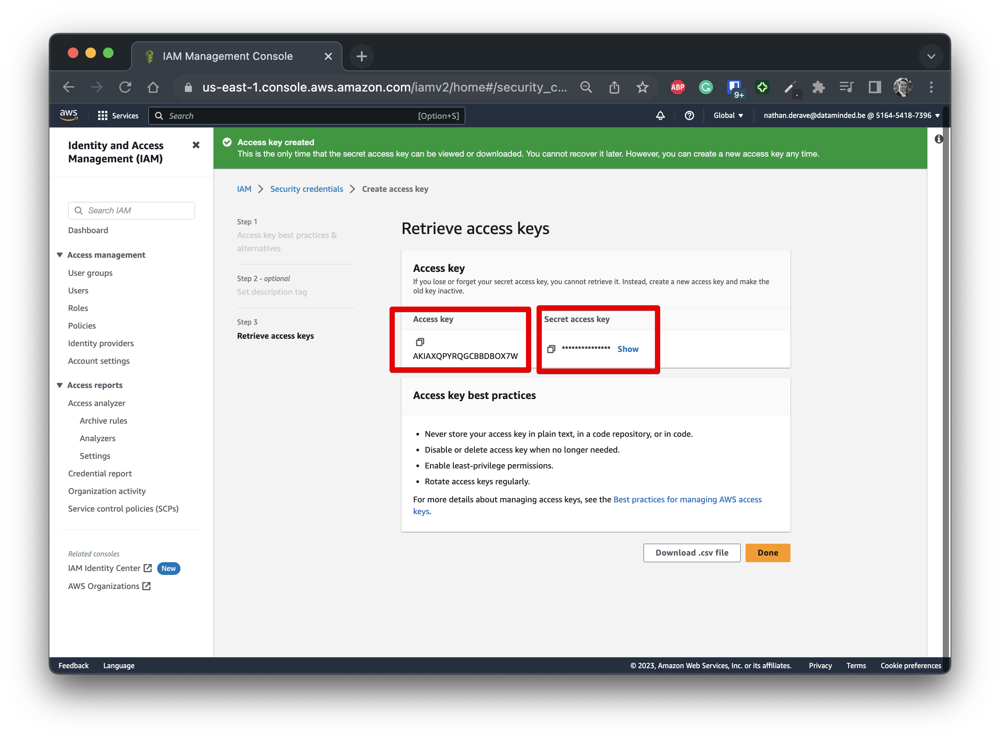
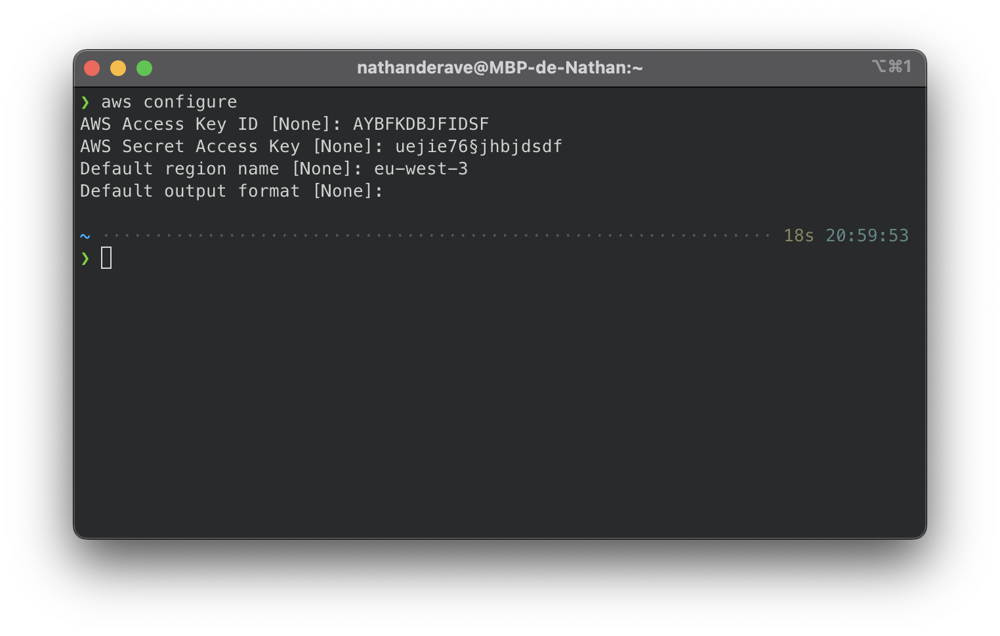
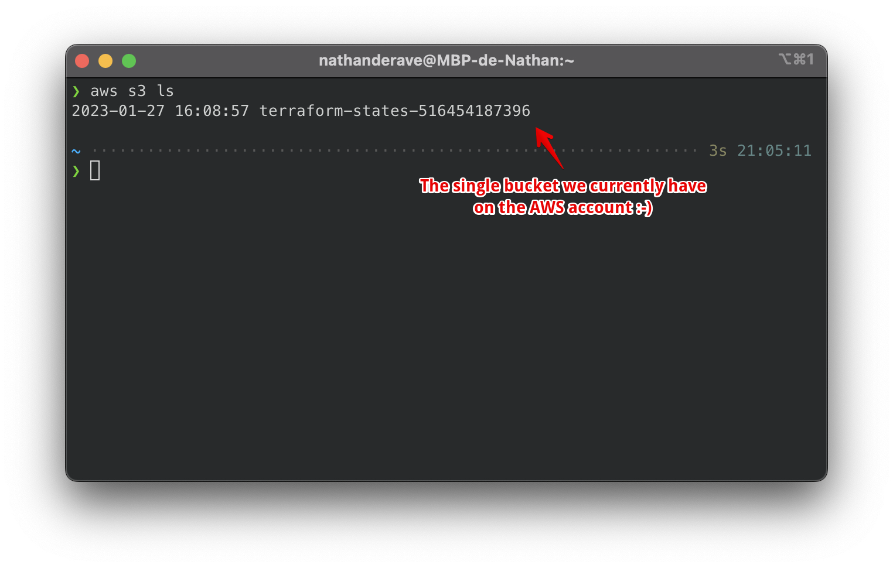
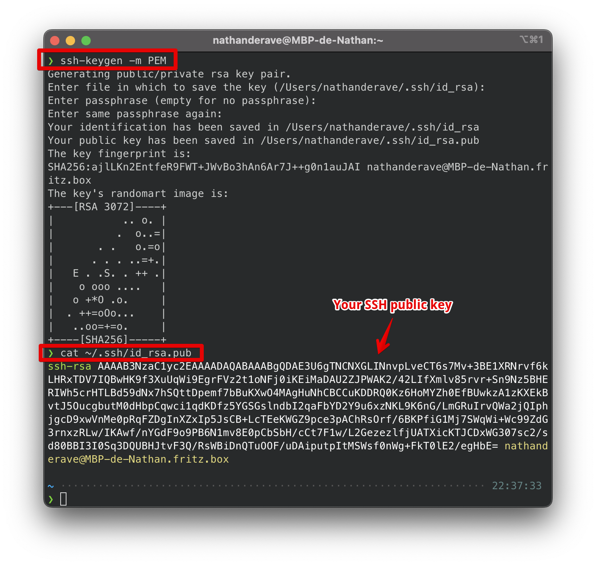
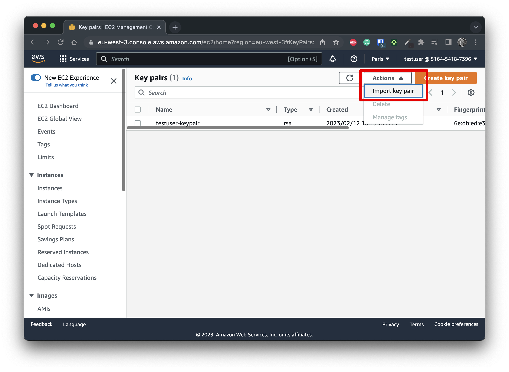
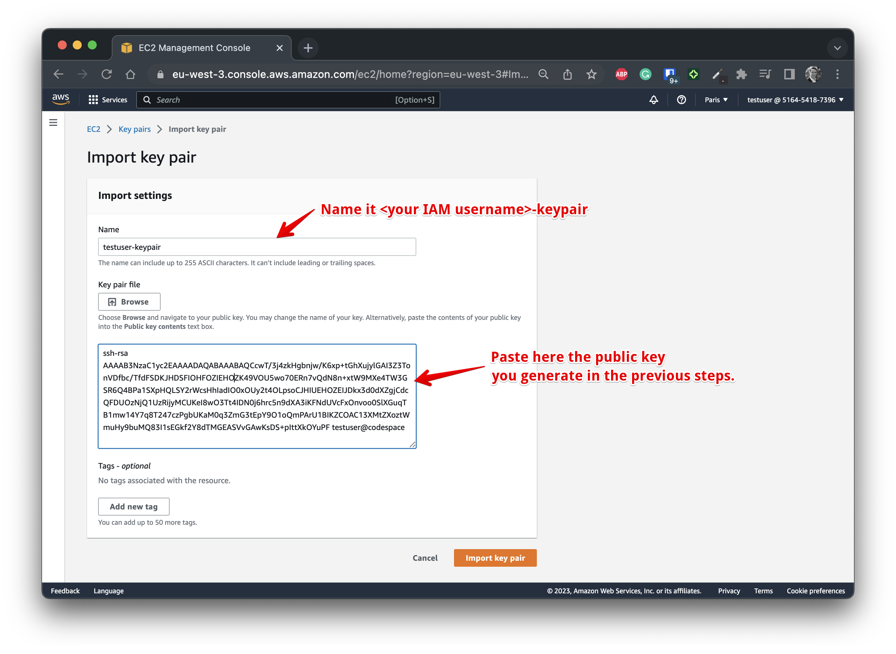

# How to get started with your AWS account?

Starting at sprint 4, your teacher will provide you with an AWS account to use during the course. This 
account will be used to provision the resources you will need to deploy your solution to the Cloud and
complete the course. 

Your teacher will provide you with a username and a temporary password that you will prompted to redefine 
at your first connection. The sections below aims at explaining you how to get access to the AWS console
(the website UI) and the `aws` command-line interface (CLI) for programmatic access to resources.

## Access the AWS console (web UI) for the first time. 

[The AWS account we are going to use in this course is accessible here.](https://516454187396.signin.aws.amazon.com/console)
The first you will connect, make sure to use your username (this won't change) and your temporary password.
After your first connection, you will be prompted to redefine the latter. Make sure you define a secured
password (8 characters, 1 number, 1 special character). If not, we will have to reset your password ourselves ;-)


Once done, you will access the AWS console web UI.You're ready to start your Cloud journey 🚀!
Make sure your region in the upper right corner is set to `Paris (eu-west-3)`.


## Install the `aws` CLI.

Accessing AWS resources solely via the web UI is not always very convenient. There are moments (to not 
say ~~always~~ often 😬) where you will prefer to use your terminal to access your AWS resources. To do
so, we will use the `aws` CLI.

To install the CLI in your machine, [you can refer to these instructions](https://docs.aws.amazon.com/cli/latest/userguide/getting-started-install.html). 
We can summarize them simply by running the following commands:
```
sudo apt-get update && sudo apt-get install unzip -y
curl "https://awscli.amazonaws.com/awscli-exe-linux-x86_64.zip" -o "awscliv2.zip"
unzip awscliv2.zip
sudo ./aws/install
```

Once done, you should be able to access the `aws` CLI in your terminal by running:
```
aws
```


## Configure your `aws` CLI. with credentials. 

Now you have installed the `aws` CLI, it's time for using it! Before being able to effectively use it,
you will need to configure your CLI with your AWS account credentials. To do so, you will need to create
a CLI access key in the AWS Console.

* Go to the `Security Credentials` section of your AWS console:



* Once in there, scroll down to the `Access keys` panel and click on `Create access key`. Select the 
`Command Line Interface (CLI)` option, click on next and fill in (or not) the description:





* On the last screen of the key creation process, make sure you took note of the `Access key` and the
`Secret access key`. We are going to need them in the next step:



* Head back to your terminal and run:
```
aws configure --profile default
```

* Fill in with the keys you noted down during the previous step. Set the default region as `eu-west-3` 
  and leave the output format as default (just press <kbd>ENTER</kbd>):



* You're all set! Your `aws` CLI should now be able to leverage the same level of access as your AWS account.
  To make sure everything is well set up, run the following command that lists all the S3 buckets:
  ```
  aws s3 ls
  ```



## Create your SSH key pair.

In order to connect to your EC2 instance later in the course, you will need to create an SSH key pair. 

SSH is a very secured way of connecting to remote machines. The mechanism relies on two keys, one private
that you keep secret for yoursel and one private that you communicate to 3rd parties. The authentication
is made by the 3rd party verifying if the communicated public key matches the secret private key you 
kept for yoursel. The AWS SSH key pair is exactly that operation of communication your public key to AWS.

To create your AWS key pair, follow these steps:

* First, you will need to generate your SSH key pair in your local/Codespace environment. To do so, 
run the following command in your terminal. Leave everything as default (just press <kbd>ENTER</kbd>):
```
ssh-keygen -m PEM
```

* Once done, you should have a new file in your current directory named `id_rsa`. This is your private key.
  You will need to keep it secret and safe. You also have a `id_rsa.pub` file that is your public key.
  This is the one you will communicate to AWS. Look at your public key by running - keep that string at hand:
  ```
  cat ~/.ssh/id_rsa.pub
  ```

  

* Now, head back to your AWS console and search for the `Key Pairs` section in the EC2 service.
  Once in there, click on `Actions` and `Import key pair`. Fill in the information properly:

  
  
  

Later, when you will create your EC2 instance using the Terraform `student-stack` module, you will 
have to give the name of that key pair you just created. It will allow you to connect transparently
to it via SSH [as explained in the dedicated documentation.](run_your_app.md)

## Conclusion & next steps.

You are now all set for the rest of the course 🎉! You can [now set up your Terraform code](terraform_get_started.md) 
and deploy resources. Terraform will leverage the set up you just did with your `aws` CLI to provision resources.
