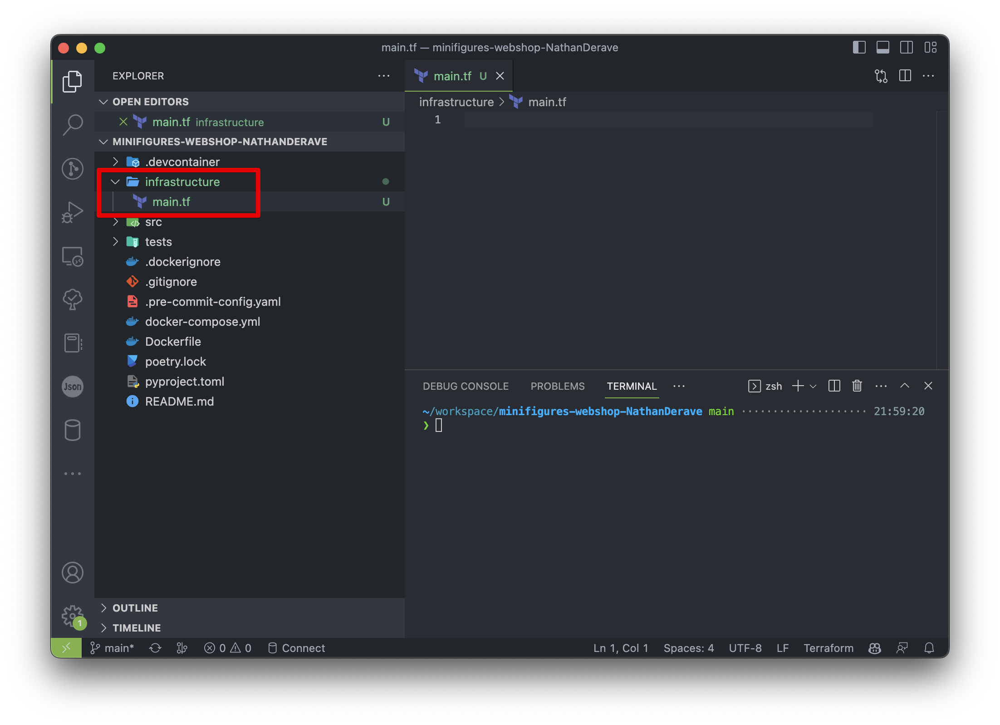
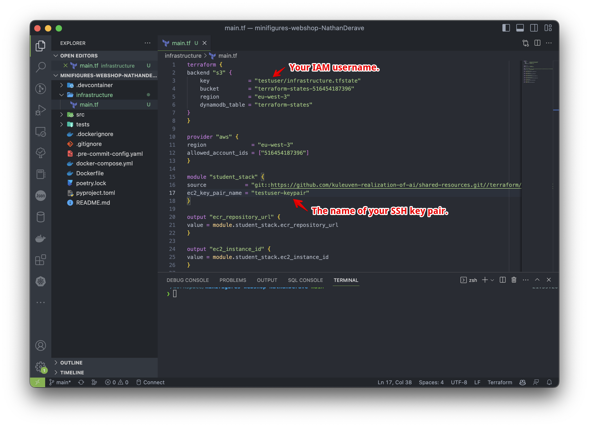
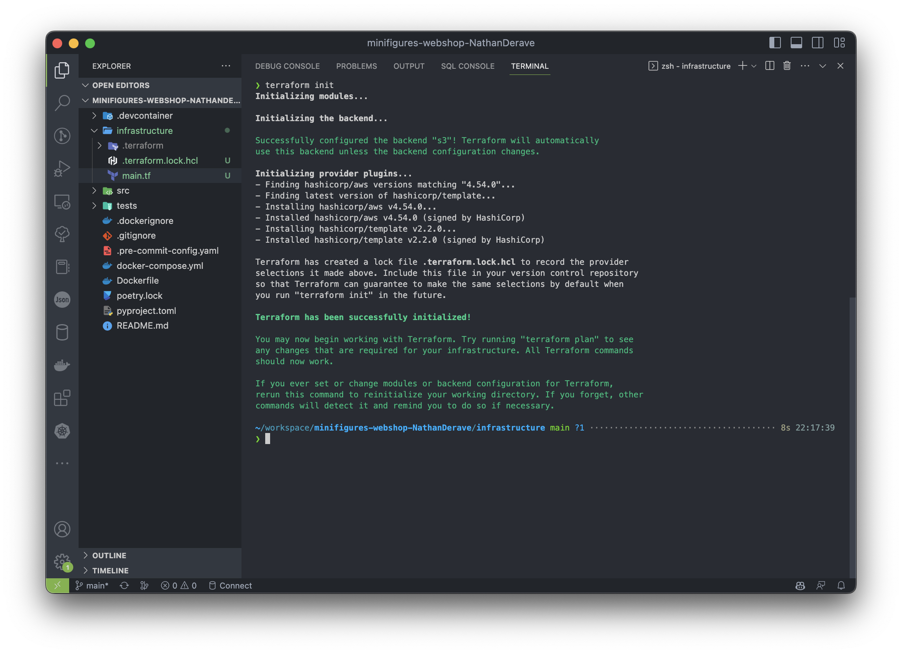
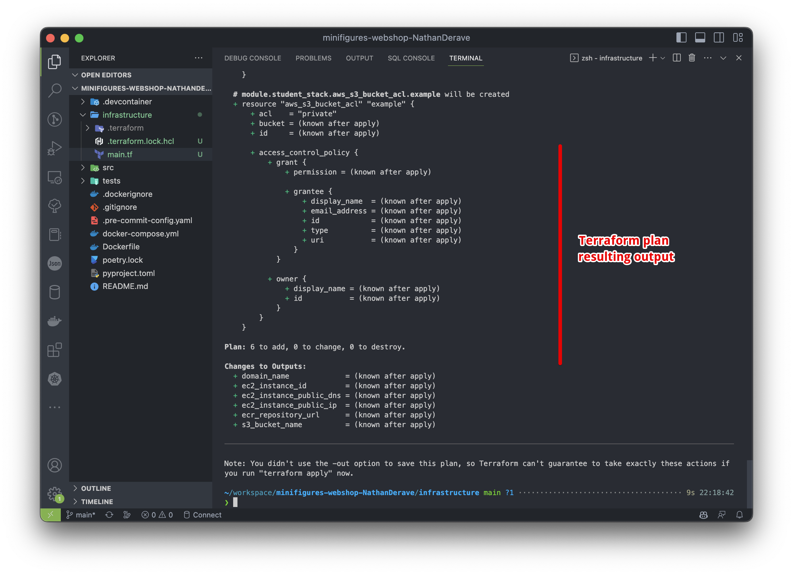
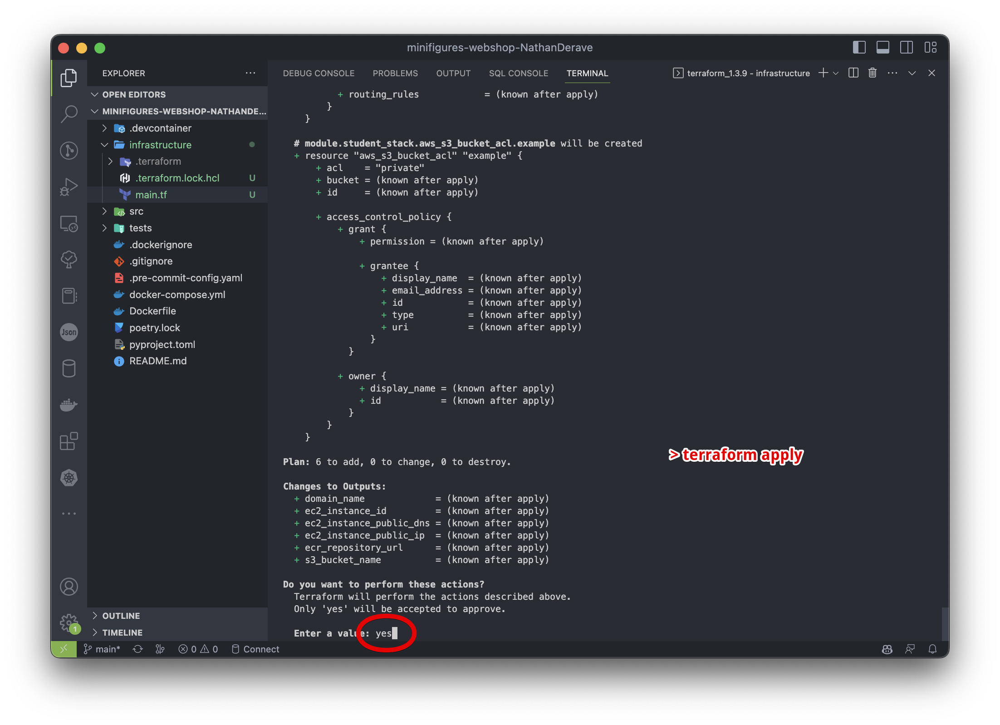
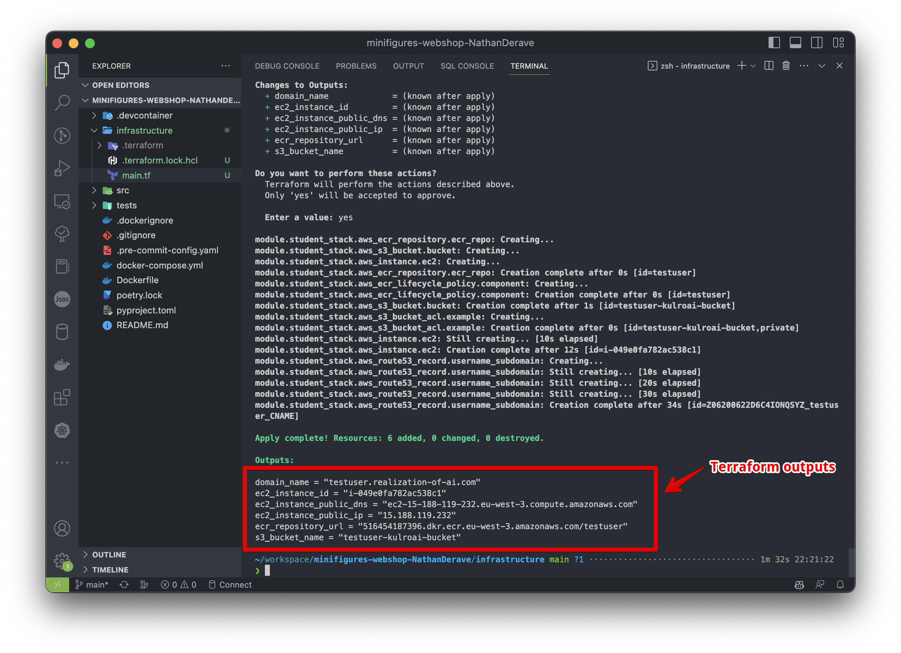

# Get started with Terraform and the `student-stack` module.

## What is the `student-stack` module?

To help you get started with Infrastructure-as-Code (IaC) and Terraform, we created the `student-stack`
module. This Terraform module will avoid you to have to write low-level Terraform resources definitions
which would involve concepts we didn't cover in this course.

The `student-stack` Terraform module will deploy for you the following AWS resources:

  * An EC2 instance (to deploy your application) assuming the `kulroai_ec2_role` IAM role. This role 
    allows the EC2 instance to read from ECR registries (for your Docker images) and S3 buckets (for 
    your ML models). The instance is deployed with the reference security group `sg_kulroai_student_vm` 
    attached to it. This security group allows inboud internet traffic on ports 80 (HTTP), 443 (HTTPS), and 22 (SSH).

  * An ECR registry (to store Docker images) named after the student's IAM user name. If your IAM user
    name is `student1`, the ECR registry will be named `student1` meaning you'll also need to tag your
    Docker images with `student1` as a name to be able to push them to the registry (e.g. `student1:latest`
    or `student1/app-image:latest`).

  * An S3 bucket with the named after the student's IAM user name. Just like for the ECR registry, if 
    your IAM user name is `student1`, the S3 bucket will be named `student1`. You have full access (create,
    read, update, delete objects) inside your bucket.

## How to use the `student-stack` module?

### Prerequisites.

Using the `student-stack` module is very simple once you have Terraform installed on your machine.
Note that you will need to have a configured `aws` CLI profile on your machine and a SSH keypair. 
[Refer to the dedicated documentation page to setup your AWS credentials properly.](./aws_get_started.md)

* To use Terraform, we will install `tfswitch` which allows you to use all versions of Terraformrun 
  through a single tool. Install `tfswitch` by running the following command:
  ```bash
  curl -L https://raw.githubusercontent.com/warrensbox/terraform-switcher/release/install.sh | bash 
  ```

* Once `tfswitch` is installed, you can use it to install the latest version of Terraform:
  ```bash
  tfswitch --latest
  ```

* You can now run `terraform` to check that it is installed and working:
  ```bash
  terraform --version
  ```

### Deploy the `student-stack` module.

Now that you have Terraform and all the prerequisites installed, you can use them to deploy the `student-stack` 
module. To do so:
  
* Create the `infrastructure` (arbitrary name) folder in your project's root. In that folder, create 
  an empty file named `main.tf`:

  

* In the `main.tf` file, copy/paste the following content. Make sure you filled in appropriately the
  the two placeholders `<INSERT HERE YOUR IAM USERNAME>` and `<INSERT HERE YOUR SSH KEYPAIR NAME>`:

  ```hcl  
  terraform {
    backend "s3" {
      key            = "<INSERT HERE YOUR IAM USERNAME>/infrastructure.tfstate"
      bucket         = "terraform-states-516454187396"
      region         = "eu-west-3"
      dynamodb_table = "terraform-states"
    }
  }

  provider "aws" {
    region              = "eu-west-3"
    allowed_account_ids = ["516454187396"]
  }

  module "student_stack" {
    source            = "git::https://github.com/kuleuven-realization-of-ai/shared-resources.git//terraform/modules/student-stack?ref=main"
    ec2_key_pair_name = <INSERT HERE YOUR SSH KEYPAIR NAME>
  }

  output "ecr_repository_url" {
    value = module.student_stack.ecr_repository_url
  }

  output "ec2_instance_id" {
    value = module.student_stack.ec2_instance_id
  }

  output "ec2_instance_public_ip" {
    value = module.student_stack.ec2_instance_public_ip
  }

  output "ec2_instance_public_dns" {
    value = module.student_stack.ec2_instance_public_dns
  }

  output "s3_bucket_name" {
    value = module.student_stack.s3_bucket_name
  }

  output "domain_name" {
    value = module.student_stack.domain_name
  }
  ```

  For example, if your IAM user name is `teststudent` and your SSH keypair name is `testuser-keypair`,
  you will end up with the following `main.tf` file:

  

* Now that you have the `main.tf` file, you can initialize Terraform and deploy the `student-stack` module.
  Start by initializing Terraform (make sure you have your `aws` CLI properly configured). From the 
  root of your repository, run:
  ```bash
  cd infrastructure
  terraform init
  ```
  

* Plan the deployment of the `student-stack` module. This will allow you to observe what are the expected
  changes to be applied by Terraform. It's a verification step. Run:
  ```bash
  terraform plan
  ```

  

* Observe the output of the `terraform plan` command. If satisfying, you can deploy your infrastructure
  by running the following command. You will have to specifically type `yes` as confirmation to deploy:
  ```bash
  terraform apply
  ```

  

* The `terraform apply` command will take a bit of time to execute (the time for AWS to provision your
  resources). Once the apply is done, you can observe the outputs of the `student-stack` module in the
  terminal. You will need them later to connect to your EC2 instance and push your Docker images to
  your ECR registry. If you want to see the outputs again, you can run the following command in your
  `infrastructure` folder:
  ```bash
  terraform output
  ```

  
  

## Conclusion & next steps.

You have now deployed your `student-stack` with all the AWS resources it contains. You can now use 
the outputs of the module to connect to your EC2 instance and run your Docker image from there. Refer
to the [dedicated documentation page](./run_your_app.md) to learn how to connect to your EC2 instance
and run your application.